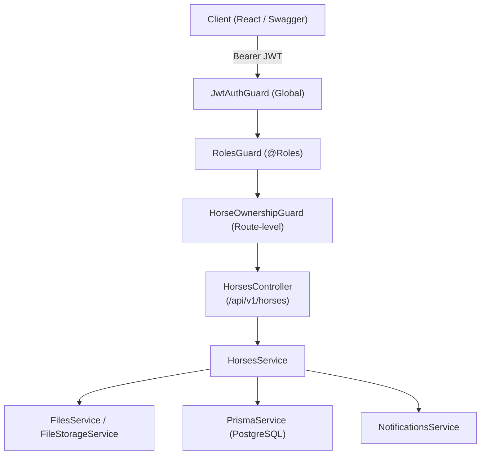
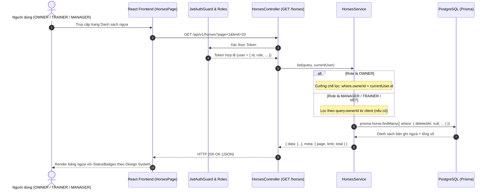
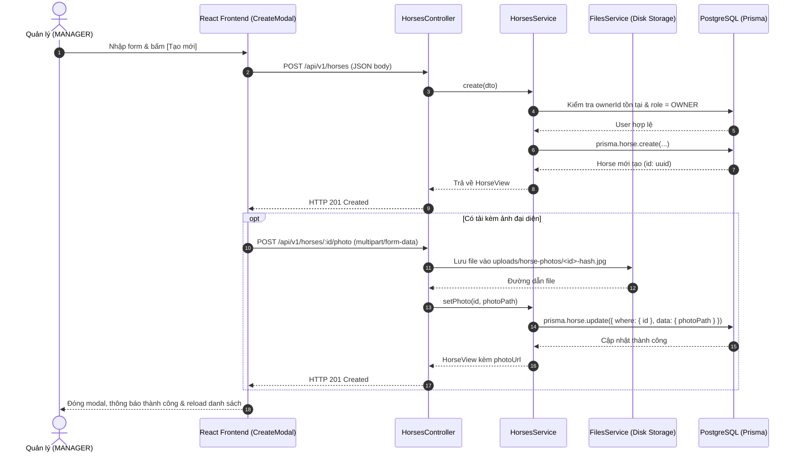

# THIẾT KẾ CHI TIẾT: FLOW 1 — HORSE PROFILE MANAGEMENT
> **Topic**: Racehorse Training & Management System (SWP391)  
> **Phạm vi**: 2 Use Case chính:  
> 1. **View Horse List & Detail** (Xem danh sách & chi tiết hồ sơ ngựa)  
> 2. **Add / Edit / Delete Horse Profile** (Thêm, sửa, xóa hồ sơ ngựa)  
> **Ngôn ngữ & Chuẩn thiết kế**:  
> - **Front-end**: Bám sát chuẩn **Racehorse Design System** từ `racehorse-design-system.html` (Tone Navy `#1c2b3a` / Cream `#f5f4f1` / Blue accent `#1a4b8a`, Font Inter, Spacing 4-32px, Radius 4-10px).  
> - **Back-end**: NestJS REST API, Prisma ORM, PostgreSQL, Passport JWT RBAC & Ownership Guard.

---

## 1. TỔNG QUAN VÀ PHÂN QUYỀN (RBAC & MATRIX)

### 1.1 Mục tiêu nghiệp vụ
- **Chủ chuồng / Quản lý (MANAGER)**: Toàn quyền tạo mới, chỉnh sửa đầy đủ thông tin (kể cả gán phả hệ bố/mẹ, ảnh đại diện, điểm thể trạng) và xóa mềm (soft-delete) hồ sơ ngựa.
- **Chủ ngựa (OWNER)**: Chỉ xem được danh sách và chi tiết các con ngựa thuộc quyền sở hữu của chính mình (`ownerId === user.id`). Tuyệt đối không được xem hoặc chỉnh sửa ngựa của chủ khác (trả về `403 Forbidden`).
- **Huấn luyện viên (TRAINER) & Groom**: Xem được danh sách và chi tiết toàn bộ ngựa trong câu lạc bộ để lên giáo án và ghi nhận buổi tập.
- **Bác sĩ thú y (VET)**: Xem toàn bộ ngựa để theo dõi y tế, khám bệnh và ban hành lệnh Khóa/Mở tập luyện (**Training Lock**).

### 1.2 Ma trận phân quyền chi tiết

| Thao tác / Chức năng | MANAGER | OWNER | TRAINER | VET | GROOM |
|---|:---:|:---:|:---:|:---:|:---:|
| **Xem danh sách ngựa (`GET /horses`)** | ✅ Tất cả | ✅ Chỉ ngựa của mình | ✅ Tất cả | ✅ Tất cả | ✅ Tất cả |
| **Xem chi tiết hồ sơ (`GET /horses/:id`)** | ✅ | ✅ (Chỉ ngựa mình) | ✅ | ✅ | ✅ |
| **Xem phả hệ 3 đời (`GET /horses/:id/pedigree`)** | ✅ | ✅ (Chỉ ngựa mình) | ✅ | ✅ | ✅ |
| **Thêm mới ngựa (`POST /horses`)** | ✅ | ❌ (403) | ❌ (403) | ❌ (403) | ❌ (403) |
| **Sửa hồ sơ ngựa (`PATCH /horses/:id`)** | ✅ | ❌ (403) | ❌ (403) | ❌ (403) | ❌ (403) |
| **Xóa mềm hồ sơ (`DELETE /horses/:id`)** | ✅ | ❌ (403) | ❌ (403) | ❌ (403) | ❌ (403) |
| **Tải lên ảnh ngựa (`POST /horses/:id/photo`)** | ✅ | ❌ (403) | ❌ (403) | ❌ (403) | ❌ (403) |
| **Khóa/Mở tập luyện (`PATCH /horses/:id/lock`)** | ❌ (Chỉ xem) | ❌ (Chỉ xem) | ❌ (Chỉ xem) | ✅ | ❌ (Chỉ xem) |

---

## 2. THIẾT KẾ BACK-END (NESTJS + PRISMA)

### 2.1 Kiến trúc các tầng (Layered Architecture)



### 2.2 Data Model (`Prisma Schema`)
Mô hình thực thể `Horse` với quan hệ tự tham chiếu phả hệ (sire/dam) và bảo lưu dữ liệu với soft-delete:

```prisma
enum HorseStatus {
  ACTIVE    // Đang thi đấu / tập luyện
  RESTING   // Đang nghỉ dưỡng
  RETIRED   // Đã giải nghệ
}

enum HealthStatus {
  FIT          // Thể trạng tốt
  MONITORING   // Cần theo dõi
  QUARANTINED  // Cách ly y tế
  INJURED      // Bị chấn thương
}

model Horse {
  id           String       @id @default(uuid())
  name         String       // 1..120 ký tự
  breed        String?      // Giống ngựa (Thoroughbred, Arabian, Quarter...)
  birthDate    DateTime?    // Ngày sinh (không được ở tương lai)
  ownerId      String       // FK trỏ tới User (Role = OWNER)
  owner        User         @relation("HorseOwner", fields: [ownerId], references: [id])
  status       HorseStatus  @default(ACTIVE)
  photoPath    String?      // Đường dẫn tương đối: "horse-photos/<id>-<hash>.<ext>"
  
  // Pedigree (Phả hệ tự tham chiếu)
  sireId       String?      // Ngựa bố
  sire         Horse?       @relation("HorsePedigree_Sire", fields: [sireId], references: [id])
  damId        String?      // Ngựa mẹ
  dam          Horse?       @relation("HorsePedigree_Dam", fields: [damId], references: [id])
  fitnessScore Int?         // Thể trạng 0..100 (đánh giá thủ công hoặc sau bài tập)
  
  // Medical & Training Lock (Phase 7 & 10)
  locked       Boolean      @default(false)
  lockReason   String?
  healthStatus HealthStatus @default(FIT)
  
  createdAt    DateTime     @default(now())
  updatedAt    DateTime     @updatedAt
  deletedAt    DateTime?    // Soft delete: null = active, timestamp = đã xóa

  // Quan hệ ngược
  siredFoals    Horse[]           @relation("HorsePedigree_Sire")
  damFoals      Horse[]           @relation("HorsePedigree_Dam")
  sessions      TrainingSession[]
  trainingPlans TrainingPlan[]
  healthRecords HealthRecord[]
  raceEntries   RaceEntry[]
  incidents     IncidentReport[]
  vaccinations  Vaccination[]

  @@index([ownerId])
  @@index([status])
  @@index([healthStatus])
  @@index([sireId])
  @@index([damId])
  @@index([deletedAt])
}
```

### 2.3 Data Transfer Objects (DTO) & Validation Rules

```typescript
// 1. DTO Tạo mới ngựa
export class CreateHorseDto {
  @IsString()
  @IsNotEmpty({ message: 'Tên ngựa không được để trống' })
  @MaxLength(120, { message: 'Tên ngựa tối đa 120 ký tự' })
  name!: string;

  @IsUUID('4', { message: 'Mã chủ sở hữu không hợp lệ' })
  @IsNotEmpty({ message: 'Chủ sở hữu là bắt buộc' })
  ownerId!: string;

  @IsOptional()
  @IsString()
  @MaxLength(120)
  breed?: string;

  @IsOptional()
  @IsISO8601({}, { message: 'Ngày sinh phải đúng định dạng ISO8601' })
  birthDate?: string;

  @IsOptional()
  @IsEnum(HorseStatus, { message: 'Trạng thái không hợp lệ' })
  status?: HorseStatus;
}

// 2. DTO Cập nhật hồ sơ ngựa
export class UpdateHorseDto {
  @IsOptional()
  @IsString()
  @IsNotEmpty()
  @MaxLength(120)
  name?: string;

  @IsOptional()
  @IsUUID('4')
  ownerId?: string;

  @IsOptional()
  @IsString()
  @MaxLength(120)
  breed?: string | null;

  @IsOptional()
  @IsISO8601()
  birthDate?: string | null;

  @IsOptional()
  @IsEnum(HorseStatus)
  status?: HorseStatus;

  @IsOptional()
  @IsUUID('4')
  sireId?: string | null;

  @IsOptional()
  @IsUUID('4')
  damId?: string | null;

  @IsOptional()
  @IsInt()
  @Min(0, { message: 'Điểm thể trạng tối thiểu 0' })
  @Max(100, { message: 'Điểm thể trạng tối đa 100' })
  fitnessScore?: number | null;
}

// 3. DTO Truy vấn danh sách ngựa
export class ListHorsesQueryDto {
  @IsOptional()
  @IsUUID('4')
  ownerId?: string;

  @IsOptional()
  @IsEnum(HorseStatus)
  status?: HorseStatus;

  @IsOptional()
  @IsEnum(HealthStatus)
  healthStatus?: HealthStatus;

  @IsOptional()
  @IsString()
  @MaxLength(120)
  q?: string; // Tìm kiếm theo tên ngựa

  @IsOptional()
  @Type(() => Number)
  @IsInt()
  @Min(1)
  page: number = 1;

  @IsOptional()
  @Type(() => Number)
  @IsInt()
  @Min(1)
  @Max(100)
  limit: number = 20;
}
```

### 2.4 Đặc tả API Endpoints (RESTful Contract)

#### `GET /api/v1/horses`
- **Mô tả**: Lấy danh sách ngựa có phân trang, bộ lọc và tìm kiếm.
- **Quyền**: Mọi role đã đăng nhập.
- **Xử lý đặc biệt**: Nếu `user.role === 'OWNER'`, hệ thống cưỡng chế `query.ownerId = user.id`.
- **Query Params**: `page` (default 1), `limit` (default 20), `status`, `healthStatus`, `q`, `ownerId`.
- **Response `200 OK`**:
```json
{
  "data": [
    {
      "id": "c1f7a2d4-...",
      "name": "Thunderbolt",
      "breed": "Thoroughbred",
      "birthDate": "2021-04-12T00:00:00.000Z",
      "status": "ACTIVE",
      "healthStatus": "FIT",
      "fitnessScore": 85,
      "locked": false,
      "photoPath": "horse-photos/thunderbolt.jpg",
      "photoUrl": "/api/v1/files/horse-photos/thunderbolt.jpg",
      "ownerId": "u821-...",
      "owner": { "id": "u821-...", "name": "Nguyễn Văn Chủ", "email": "owner1@racehorse.local" },
      "createdAt": "2026-09-08T03:26:35.000Z",
      "updatedAt": "2026-09-30T10:00:00.000Z"
    }
  ],
  "meta": { "page": 1, "limit": 20, "total": 12 }
}
```

#### `GET /api/v1/horses/:id`
- **Mô tả**: Lấy chi tiết 1 con ngựa.
- **Quyền**: Tất cả, qua `HorseOwnershipGuard`. Nếu `OWNER` xem ngựa người khác → `403 Forbidden`. Nếu ngựa đã bị soft-delete (`deletedAt != null`) → `404 Not Found`.

#### `POST /api/v1/horses`
- **Mô tả**: Tạo mới 1 hồ sơ ngựa.
- **Quyền**: `MANAGER` duy nhất (`@Roles(Role.MANAGER)`).
- **Quy tắc kiểm tra nghiệp vụ**:
  1. `ownerId` phải trỏ tới 1 tài khoản có `role = OWNER`, `status = ACTIVE`, `deletedAt = null`. Nếu sai → `400 VALIDATION_ERROR`.
  2. `birthDate` không được vượt quá thời điểm hiện tại (`birthDate <= new Date()`).
- **Response `201 Created`**: Trả về Horse object đầy đủ.

#### `PATCH /api/v1/horses/:id`
- **Mô tả**: Chỉnh sửa thông tin ngựa, đổi chủ, hoặc gán bố/mẹ/điểm thể trạng.
- **Quyền**: `MANAGER` duy nhất.
- **Quy tắc phả hệ (Pedigree Rules)**:
  1. `sireId !== id` và `damId !== id` (không thể tự làm bố/mẹ của chính mình).
  2. `sireId !== damId` khi cả 2 cùng có giá trị (bố và mẹ không thể là cùng 1 con ngựa).
  3. Bố và mẹ phải tồn tại và chưa bị xóa mềm trong cơ sở dữ liệu.
- **Response `200 OK`**: Horse object sau khi cập nhật.

#### `DELETE /api/v1/horses/:id`
- **Mô tả**: Xóa mềm hồ sơ ngựa (`deletedAt = new Date()`).
- **Quyền**: `MANAGER` duy nhất.
- **Lưu ý**: Dữ liệu lịch sử tập luyện và hồ sơ y tế vẫn được giữ nguyên tính toàn vẹn trong database nhưng không còn hiển thị ở danh sách chính.
- **Response `200 OK`**: `{ "message": "Horse deleted successfully" }`.

#### `POST /api/v1/horses/:id/photo`
- **Mô tả**: Upload ảnh đại diện cho ngựa (chấp nhận JPG, PNG, WEBP, tối đa 5MB).
- **Quyền**: `MANAGER`.
- **Cơ chế**: Ghi file vào thư mục `uploads/horse-photos/`, tự động dọn dẹp file ảnh cũ nếu có.

#### `GET /api/v1/horses/:id/pedigree`
- **Mô tả**: Truy xuất cây phả hệ 3 đời đệ quy (Ngựa → Cha/Mẹ → Ông/Bà nội ngoại) với cơ chế phòng ngừa vòng lặp vô tận (`Set<string>` cycle-safe).

---

## 3. THIẾT KẾ FRONT-END (REACT + VITE + TAILWIND)
*(Sử dụng chuẩn màu và token từ `racehorse-design-system.html`)*

### 3.1 Design System Tokens tham chiếu

```css
/* Trích xuất trực tiếp từ racehorse-design-system.html */
:root {
  --brand-navy: #1c2b3a;           /* Màu thương hiệu chính: Header, Sidebar, Nút hành động */
  --brand-navy-hover: #243447;
  --surface-page: #f5f4f1;         /* Nền tổng thể trang (Cream) */
  --surface-card: #ffffff;         /* Nền card, table, panel */
  --surface-subtle: #fafaf8;       /* Hover hàng bảng, card phụ */
  --border-default: #e2e0db;       /* Viền chuẩn */
  --border-strong: #cdc9c3;        /* Viền nhấn */
  --text-primary: #1a1f2e;         /* Chữ đen sắc nét */
  --text-secondary: #6b7280;       /* Chữ phụ, label, hint */
  
  /* Status Color Tokens */
  --status-success: #3a6b4a; --status-success-bg: #edf7f0; /* FIT / Hoàn thành */
  --status-warning: #8a6218; --status-warning-bg: #fdf6e8; /* MONITORING / Cảnh báo */
  --status-danger:  #8a2020; --status-danger-bg:  #fdf0f0; /* INJURED / LOCKED */
  --status-info:    #1a4b8a; --status-info-bg:    #eef3fb; /* ACTIVE / Published */
  --status-neutral: #6b7280; --status-neutral-bg: #f5f4f1; /* RESTING / RETIRED */

  /* Typography: Inter duy nhất */
  font-family: 'Inter', -apple-system, BlinkMacSystemFont, sans-serif;
}
```

### 3.2 Cấu trúc Component Frontend

```
apps/web/src/
├── pages/
│   ├── HorsesPage.tsx            # Use Case 1 & 2: Danh sách ngựa, Toolbar, Bộ lọc, KPI Card
│   └── HorseDetailPage.tsx       # Use Case 1 & 2: Chi tiết hồ sơ, Profile Tab, Pedigree Tab, Edit Actions
├── components/horse/
│   ├── HorseCard.tsx             # Card ngựa hiển thị trên grid/table
│   ├── HorseStatusBadge.tsx      # Huy hiệu trạng thái (Career & Health) chuẩn Design System
│   ├── HorseMetricCards.tsx      # Thống kê tổng số ngựa, thi đấu, nghỉ dưỡng, cần chú ý
│   ├── CreateHorseModal.tsx      # Modal thêm ngựa mới (Role: MANAGER)
│   ├── EditHorseModal.tsx        # Modal chỉnh sửa thông tin & đổi chủ (Role: MANAGER)
│   ├── DeleteHorseModal.tsx      # Dialog xác nhận xóa mềm an toàn (Role: MANAGER)
│   ├── PedigreeTree.tsx          # Cây phả hệ 3 đời trực quan
│   └── PhotoUploadModal.tsx      # Modal tải ảnh đại diện lên
```

---

## 4. THIẾT KẾ CHI TIẾT 2 USE CASE CHÍNH

### USE CASE 1: VIEW HORSE LIST & DETAIL

#### 1. Màn hình Danh sách ngựa (`HorsesPage`)

```
+--------------------------------------------------------------------------------------------------+
|  Racehorse Club             [🐴 Danh sách ngựa]   [📅 Lịch tập]   [🩺 Y tế]      Admin (MANAGER) |
+--------------------------------------------------------------------------------------------------+
|                                                                                                  |
|  DANH SÁCH HỒ SƠ NGỰA                                                                            |
|  Quản lý toàn bộ danh sách ngựa đua, theo dõi thể trạng và quyền sở hữu trong câu lạc bộ.       |
|                                                                                                  |
|  +--------------------+  +--------------------+  +--------------------+  +--------------------+  |
|  | TỔNG SỐ NGỰA       |  | ĐANG THI ĐẤU       |  | NGHỈ DƯỠNG / GIẢI  |  | CẦN CHÚ Ý / KHÓA   |  |
|  | 12                 |  | 8                  |  | 4                  |  | 2                  |  |
|  +--------------------+  +--------------------+  +--------------------+  +--------------------+  |
|                                                                                                  |
|  [🔍 Tìm theo tên ngựa...     ]  [Tất cả] [Đang thi đấu] [Nghỉ dưỡng] [Giải nghệ]  [+ Thêm ngựa mới] |
|                                                                                                  |
|  +--------------------------------------------------------------------------------------------+  |
|  | NGỰA / GIỐNG         | TUỔI & NGÀY SINH | CHỦ SỞ HỮU     | THỂ TRẠNG | TRẠNG THÁI  | THAO TÁC |  |
|  |----------------------|------------------|----------------|-----------|-------------|----------|  |
|  | [⚡] Thunderbolt     | 5 tuổi           | Phạm Thế Cường | 85 / 100  | [● ACTIVE]  | [Sửa]    |  |
|  |     Thoroughbred     | 12/04/2021       | (owner1@...)   | [ FIT ]   |             | [Xóa]    |  |
|  |----------------------|------------------|----------------|-----------|-------------|----------|  |
|  | [🌊] Sea Breeze      | 4 tuổi           | Lê Quang Hải   | 68 / 100  | [● RESTING] | [Sửa]    |  |
|  |     Arabian          | 18/06/2022       | (owner2@...)   | [MONITOR] | [🔒 LOCKED] | [Xóa]    |  |
|  +--------------------------------------------------------------------------------------------+  |
|  Trang 1 / 1 (Hiển thị 12 con ngựa)                                                               |
+--------------------------------------------------------------------------------------------------+
```

#### 2. Màn hình Chi tiết hồ sơ ngựa (`HorseDetailPage`)
- **Header Profile Card**:
  - Avatar tròn lớn (Hiển thị ảnh upload hoặc ký tự hoa đầu).
  - Nút **[Đổi ảnh đại diện]** cho Manager.
  - Tên ngựa (Display H1 `32px font-weight 600`), Giống loài, Tuổi tính tự động từ ngày sinh.
  - Badge trạng thái kết hợp: `[ACTIVE]` (Info/Blue), `[FIT]` (Success/Green), `[🔒 Khoá tập luyện]` (Danger/Red - nếu có).
  - Điểm thể trạng (Fitness Score) dạng thanh tiến trình nhỏ hoặc số điểm `85 / 100`.
- **Cảnh báo Training Lock** (Nếu ngựa đang bị khóa): Banner đỏ nhạt viền đỏ đậm hiển thị lý do bác sĩ thú y khóa tập luyện.
- **Tab Navigation**:
  - **Tab 1: Hồ sơ chi tiết (Profile)**: Bố cục 2 cột key-value: Giống loài, Ngày sinh, Giới tính, Chủ sở hữu, Mã vi chip, Điểm thể trạng, Bố (Sire link), Mẹ (Dam link), Ngày đăng ký hồ sơ.
  - **Tab 2: Phả hệ (Pedigree)**: Hiển thị dạng thẻ cây 3 đời (Đời 1: Ngựa chính; Đời 2: Bố & Mẹ; Đời 3: 4 Ông/Bà nội ngoại). Bấm vào tên ngựa tổ tiên sẽ điều hướng sang hồ sơ con đó.
  - **Tab 3: Giáo án & Buổi tập (Sessions)**.
  - **Tab 4: Y tế & Điều trị (Health)**.

---

### USE CASE 2: ADD / EDIT / DELETE HORSE PROFILE

#### 1. Thêm mới ngựa (`CreateHorseModal`)
- **Trigger**: Nút **[+ Thêm ngựa mới]** ở góc phải Toolbar (Chỉ hiển thị với role `MANAGER`).
- **Form Controls**:
  - `Tên ngựa *`: Ô input text, bắt buộc, tối đa 120 ký tự.
  - `Chủ sở hữu *`: Dropdown lấy danh sách từ `GET /api/v1/users?role=OWNER&status=ACTIVE`. Hiển thị dạng `Họ tên (email)`.
  - `Giống loài`: Input text hoặc datalist gợi ý (`Thoroughbred`, `Arabian`, `Quarter Horse`, `Appaloosa`).
  - `Ngày sinh`: Date picker, có validate `max = today` (không cho chọn ngày tương lai).
  - `Trạng thái ban đầu`: Dropdown chọn `ACTIVE` (mặc định), `RESTING`, hoặc `RETIRED`.
- **UX**: Khi ấn "Lưu", nút chuyển trạng thái loading disabled, bắt lỗi validation từ server hiển thị tại từng field. Thành công tự đóng modal và trigger tải lại bảng danh sách.

#### 2. Sửa hồ sơ ngựa (`EditHorseModal`)
- **Trigger**: Nút **[Sửa hồ sơ]** tại trang danh sách hoặc nút hành động trên Header trang chi tiết.
- **Dữ liệu nạp trước (Pre-fill)**: Đầy đủ tên, giống, ngày sinh, chủ sở hữu, trạng thái.
- **Mở rộng gán phả hệ & thể trạng**:
  - `Ngựa cha (Sire)`: Dropdown chọn các con ngựa khác trong danh sách (loại trừ chính nó và các con đực/cái không phù hợp). Có tùy chọn `— Không chọn —`.
  - `Ngựa mẹ (Dam)`: Dropdown chọn ngựa mẹ (loại trừ chính nó và ngựa cha đã chọn).
  - `Điểm thể trạng (Fitness Score)`: Ô nhập số từ `0` đến `100`.
- **Validate chống lỗi**: Nếu người dùng chọn cùng 1 con ngựa cho cả Cha và Mẹ, giao diện sẽ cảnh báo tức thì trước khi gửi request lên server.

#### 3. Xóa mềm hồ sơ (`DeleteHorseModal`)
- **Trigger**: Nút biểu tượng thùng rác hoặc nút **[Xóa ngựa]** màu đỏ (`btn-danger`).
- **Nội dung cảnh báo**:
  > *"Bạn có chắc chắn muốn xóa hồ sơ ngựa **Thunderbolt**? Hồ sơ này sẽ bị ẩn khỏi danh sách hoạt động của câu lạc bộ. Lịch sử tập luyện và hồ sơ y tế liên quan sẽ được bảo lưu an toàn."*
- **Action**: Gửi `DELETE /api/v1/horses/:id`. Sau khi thành công, redirect người dùng về trang `/horses` và hiển thị toast thông báo hoàn tất.

---

## 5. SƠ ĐỒ TUẦN TỰ (SEQUENCE DIAGRAMS)

### 5.1 Quy trình Xem danh sách ngựa (Áp dụng phân quyền OWNER)



### 5.2 Quy trình Thêm mới và Gán ảnh đại diện



---

## 6. KẾ HOẠCH TRIỂN KHAI VÀ CHECKLIST KIỂM THỬ

### 6.1 Các bước thực hiện
1. **Kiểm tra & chuẩn hóa Backend**: Đảm bảo các route `GET`, `POST`, `PATCH`, `DELETE`, `photo`, `pedigree` trong `apps/api/src/horses` đã sẵn sàng và 100% test E2E vượt qua (15/15 test cases trong `test/horses.e2e-spec.ts`).
2. **Cập nhật CSS & Tokens ở Frontend**: Tích hợp các biến CSS từ `racehorse-design-system.html` vào `apps/web/src/index.css`.
3. **Phát triển giao diện**:
   - Nâng cấp `HorsesPage.tsx` với Toolbar chuẩn, Metric Cards, StatusBadges, Modal Thêm ngựa mới.
   - Nâng cấp `HorseDetailPage.tsx` với Hero Banner, Tab Hồ sơ chi tiết, Tab Phả hệ 3 đời, Modal Sửa & Xóa.
4. **Kiểm thử tích hợp (Integration Smoke Test)**:
   - Thử nghiệm đăng nhập tài khoản `manager@racehorse.local`: Tạo ngựa mới, sửa ngựa, gán bố mẹ, upload ảnh, xóa ngựa.
   - Thử nghiệm đăng nhập tài khoản `owner1@racehorse.local`: Đảm bảo chỉ thấy ngựa của mình, không thấy nút Thêm/Sửa/Xóa.
